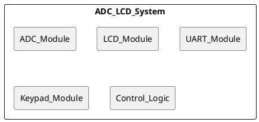
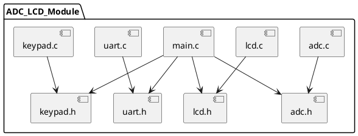

# ADC LCD Interface Design

| **Author**              | `Seif Salama, Malik Babiker, Mostafa Hatem`                                       |
|:------------------------|:-----------------------------------------------------|
| **Status**              | `Draft/Inspection/Approved`                          |
| **Version**             | `1.0`                                                |
| **Date**                | `11/11/2024`                                         |

## Introduction

This report provides an overview and low-level design specification for an ADC LCD Interface, displaying analog sensor data (e.g., from a potentiometer or LDR) on an LCD. It includes configuration settings for upper (HHM) and lower (LLM) threshold limits, which can be adjusted through keypad input, with alerts triggered when readings exceed these limits. This design uses native C programming, without Arduino-based code or pre-developed libraries.

### Purpose
The purpose of this specification is to outline the internal structure, functional components, and embedded constraints for implementing the ADC LCD Interface module, forming the basis for coding and module testing.

### Scope
The scope of this document includes:

- Design and implementation of the ADC LCD Interface system.
- Integration of analog sensors (e.g., potentiometer or LDR) and display of their values on an LCD screen.
- User-configurable threshold limits via keypad input.
- Alert mechanism to notify the user when sensor readings exceed the defined limits.

This document serves as the reference for both coding and module testing, ensuring that the system works within the defined constraints and meets the project requirements.

The module priority is classified as P2, indicating that it is a necessary part of the system but not critical for initial deployment.

### Defnitions and Acronym
| **Abbreviation** |             **Meaning**             |
|:----------------:|:-----------------------------------:|
| ADC              | Analog-to-Digital Converter              |
| UART             | Universal Asynchronous Receiver Transmitter |
| LCD              | Liquid Crystal Display                  |
| POT              | Potentiometer                            |
| LDR              | Light Dependent Resistor                |

## Architectural Overview

This section describes where this module resides in the context of the embedded system's software architecture


### Assumptions & Constraints

1. This system assumes stable input from sensors, using averaging to reduce noise.
2. The LCD display has limited character space, requiring concise data representation.
3. The module operates within the 8-bit MCU memory constraints and processing capacity.

```plantuml
@startuml
(*) --> [Init]
--> [Configure ADC, UART, LCD]
if "Key = '1' or '2'" then
  --> [Set Channel]
else
  --> [Await Key Input]
endif
@enduml
```

## Functional Description
The ADC LCD Interface reads analog values from sensors connected to specified ADC channels. Data is sampled (for noise reduction) and displayed on an LCD. Threshold limits for sensor readings can be adjusted using a keypad, and UART communication sends real-time data to an external monitor.

## Implementation of the Module
This chapter discusses the detailed design of the module.

- ADC Initialization: Initializes ADC for specified channels.
- LCD Display Functions: Displays sensor type, reading, and threshold limits.
- UART Communication: Transmits real-time sensor data over UART.
- Keypad Input Handling: Adjusts LLM/HHM thresholds.

## Integration and Configuration
### Static Files

| File name | Contents                             |
|-----------|--------------------------------------|
| main.ino | Source code for main application   |
| dio.ino     | Source code for DIO functions  |
| dio.h    | Header file for DIO functions |
| uart.ino    | Source code for UART functions |
| uart.h    | Header file for UART functions |
| adc.ino    | Source code for ADC functions |
| adc.h    | Header file for ADC functions |
| Lcd.ino    | Source code for LCD functions |
| Lcd.h    | Header file for LCD functions |
| keypad.ino    | Source code for Keypad functions |
| keypad.h    | Header file for Keypad functions |

### Include Structure

The following diagram shows dependencies upon files in the module.



### Configuration
Any required hardware/software or system configuration that can be adjusted a header file shall be detailed in this section. This can be placed in the table below.
| Name | Value range | Description |
|------|-------------|-------------|
| LLM           | 0 - 1023        | Lower threshold limit for sensor readings     |
| HHM           | 0 - 1023        | Upper threshold limit for sensor readings     |
| UART_BaudRate | 9600            | Baud rate for UART communication              |
| SAMPLE_N0     | 20              | Number of samples for averaging sensor data   |